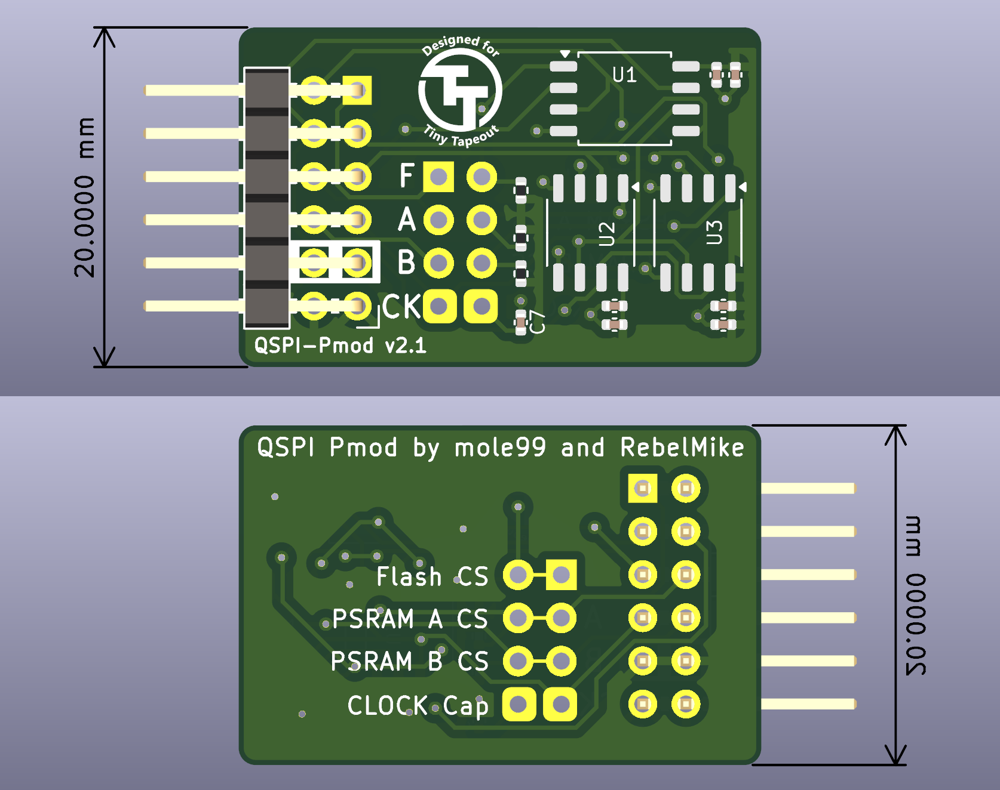

# QSPI Pmod

A QSPI Pmod board designed in KiCad with one SPI Flash and two SPRAMs.

# Pinout

| Pmod  | TinyTapeout | Function |
|-------|-------------|----------|
| PMOD1 | uio[0]      | CS0      |
| PMOD2 | uio[1]      | SD0/MOSI |
| PMOD3 | uio[2]      | SD1/MISO |
| PMOD4 | uio[3]      | SCK      |
| PMOD5 | uio[4]      | SD2      |
| PMOD6 | uio[5]      | SD3      |
| PMOD7 | uio[6]      | CS1      |
| PMOD8 | uio[7]      | CS2      |